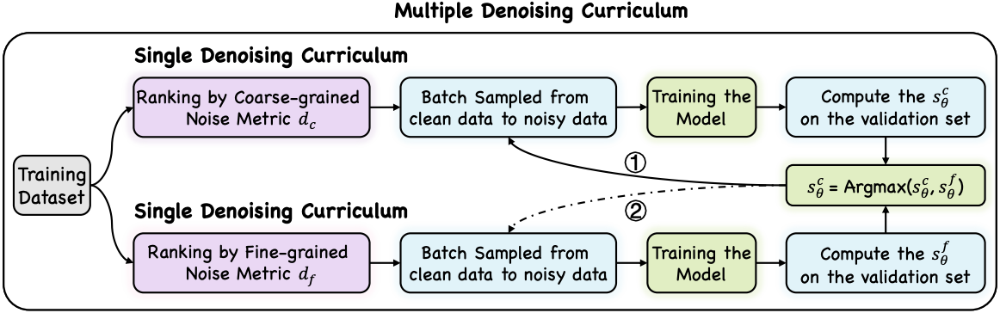

# M2DF

The implementation of EMNLP2023 paper "[M2DF: Multi-grained Multi-curriculum Denoising Framework for Multimodal Aspect-based Sentiment Analysis](https://arxiv.org/pdf/2310.14605.pdf)"

## Overview



## Setup

### Dependencies

```
+ python 3.7.13
+ torch 1.12.0+cu113
+ numpy 1.21.6
+ transformers==3.4.0
+ fastnlp
+ h5py
```


### Download and preprocess the datasets

Because the image features after processing is very large, you can download them via the link [Google Drive](https://drive.google.com/drive/folders/1dXtmvkLi1N19Uv6zWClNnK2P3WYkexKQ?usp=share_link). It should be noted that the path of the data is consistent with the file tree.

```
├── /src/
│  ├── /data/
│  │  │  ├── /jsons/	       
│  │  │  │  ├── twitter15_info.json	        
│  │  │  │  ├── twitter17_info.json
│  │  │  │  ├── amended_similarity_by_region2015.json fine-grained similarity
│  │  │  │  ├── amended_similarity_by_region2017.json
│  │  │  │  ├── amended_similarity_by_whole2015.json coarse-grained similarity
│  │  │  │  ├── amended_similarity_by_whole2017.json
│  ├── /twitter2015/
│  ├── /twitter2017/
│  ├── /twitter2015_box_att_NER/
│  ├── /twitter2017_box_att_NER/
```

### Usage

- Train and Test on twitter2015

```bash
sh 15_pretrain_full.sh
```

- Train and Test on twitter2017

```bash
sh 17_pretrain_full.sh
```

### Logs

```bash
Training log on tw17 (trained on GeForce GTX 1080 Ti) and tw15 (GeForce GTX 3090 Ti) are placed in the \log\
```

## Results

**For the JMASA Task**

<details>
<table>
    <tr>
        <td>Model</td>
        <td colspan="3" style="text-align: center;">TWITTER-15</td>
        <td colspan="3" style="text-align: center;">TWITTER-17</td>
    </tr>
    <tr>
        <td></td>
        <td style="text-align: center;">Pre</td>
        <td style="text-align: center;">Rec</td>
        <td style="text-align: center;">F1</td>
        <td style="text-align: center;">Pre</td>
        <td style="text-align: center;">Rec</td>
        <td style="text-align: center;">F1</td>
    </tr>
    <tr>
        <td>UMT-collapse</td>
        <td style="text-align: center;">60.4 </td>
        <td style="text-align: center;">61.6 </td>
        <td style="text-align: center;">61.0 </td>
        <td style="text-align: center;">60.0 </td>
        <td style="text-align: center;">61.7 </td>
        <td style="text-align: center;">60.8 </td>
    </tr>
    <tr>
        <td>UMT-collapse + M2DF</td>
        <td style="text-align: center;">61.1&plusmn0.40 </td>
        <td style="text-align: center;">63.4&plusmn0.57 </td>
        <td style="text-align: center;">62.2&plusmn0.10 </td>
        <td style="text-align: center;">60.9&plusmn0.28 </td>
        <td style="text-align: center;">62.0&plusmn0.52 </td>
        <td style="text-align: center;">61.4&plusmn0.13 </td>
    </tr>
    <tr>
        <td>OSCGA-collapse</td>
        <td style="text-align: center;">63.1 </td>
        <td style="text-align: center;">63.7 </td>
        <td style="text-align: center;">63.2 </td>
        <td style="text-align: center;">63.5 </td>
        <td style="text-align: center;">63.5 </td>
        <td style="text-align: center;">63.5 </td>
    </tr>
    <tr>
        <td>OSCGA-collapse + M2DF</td>
        <td style="text-align: center;">64.4&plusmn0.37 </td>
        <td style="text-align: center;">64.6&plusmn0.45 </td>
        <td style="text-align: center;">64.5&plusmn0.13 </td>
        <td style="text-align: center;">64.1&plusmn0.11 </td>
        <td style="text-align: center;">63.9&plusmn0.16 </td>
        <td style="text-align: center;">64.0&plusmn0.12 </td>
    </tr>
    <tr>
        <td>RpBERT</td>
        <td style="text-align: center;">49.3 </td>
        <td style="text-align: center;">46.9 </td>
        <td style="text-align: center;">48.0 </td>
        <td style="text-align: center;">57.0 </td>
        <td style="text-align: center;">55.4 </td>
        <td style="text-align: center;">56.2 </td>
    </tr>
    <tr>
        <td>RpBERT + M2DF</td>
        <td style="text-align: center;">49.3&plusmn0.20 </td>
        <td style="text-align: center;">49.0&plusmn0.25 </td>
        <td style="text-align: center;">49.2&plusmn0.15 </td>
        <td style="text-align: center;">56.9&plusmn0.34 </td>
        <td style="text-align: center;">56.5&plusmn0.38 </td>
        <td style="text-align: center;">56.7&plusmn0.22 </td>
    </tr>
    <tr>
        <td>RDS</td>
        <td style="text-align: center;">60.8 </td>
        <td style="text-align: center;">61.7 </td>
        <td style="text-align: center;">61.2 </td>
        <td style="text-align: center;">61.8 </td>
        <td style="text-align: center;">62.9 </td>
        <td style="text-align: center;">62.3 </td>
    </tr>
    <tr>
        <td>RDS + M2DF</td>
        <td style="text-align: center;">61.2&plusmn0.12 </td>
        <td style="text-align: center;">63.0&plusmn0.35 </td>
        <td style="text-align: center;">62.1&plusmn0.15 </td>
        <td style="text-align: center;">62.4&plusmn0.16 </td>
        <td style="text-align: center;">63.6&plusmn0.12 </td>
        <td style="text-align: center;">63.0&plusmn0.08 </td>
    </tr>
    <tr>
        <td>JML</td>
        <td style="text-align: center;">64.8 </td>
        <td style="text-align: center;">63.6 </td>
        <td style="text-align: center;">64.0 </td>
        <td style="text-align: center;">65.6 </td>
        <td style="text-align: center;">66.1 </td>
        <td style="text-align: center;">65.9 </td>
    </tr>
    <tr>
        <td>JML + M2DF</td>
        <td style="text-align: center;">64.9&plusmn0.36 </td>
        <td style="text-align: center;">65.3&plusmn0.16 </td>
        <td style="text-align: center;">65.1&plusmn0.25 </td>
        <td style="text-align: center;">67.7&plusmn0.30 </td>
        <td style="text-align: center;">67.0&plusmn0.08 </td>
        <td style="text-align: center;">67.3&plusmn0.16 </td>
    </tr>
    <tr>
        <td>VLP-MABSA</td>
        <td style="text-align: center;">64.1 </td>
        <td style="text-align: center;">68.6 </td>
        <td style="text-align: center;">66.3 </td>
        <td style="text-align: center;">65.8 </td>
        <td style="text-align: center;">67.9 </td>
        <td style="text-align: center;">66.9 </td>
    </tr>
    <tr>
        <td>VLP-MABSA + M2DF</td>
        <td style="text-align: center;">67.0&plusmn0.20 </td>
        <td style="text-align: center;">68.3&plusmn0.26 </td>
        <td style="text-align: center;">67.6&plusmn0.18 </td>
        <td style="text-align: center;">67.9&plusmn0.10 </td>
        <td style="text-align: center;">68.8&plusmn0.37 </td>
        <td style="text-align: center;">68.3&plusmn0.18 </td>
    </tr>
</table>
</details>

---

**For the MATE Task**
<details>

<table>
    <tr>
        <td>Model</td>
        <td colspan="3" style="text-align: center;">TWITTER-15</td>
        <td colspan="3" style="text-align: center;">TWITTER-17</td>
    </tr>
    <tr>
        <td></td>
        <td style="text-align: center;">Pre</td>
        <td style="text-align: center;">Rec</td>
        <td style="text-align: center;">F1</td>
        <td style="text-align: center;">Pre</td>
        <td style="text-align: center;">Rec</td>
        <td style="text-align: center;">F1</td>
    </tr>
    <tr>
        <td>UMT</td>
        <td style="text-align: center;">77.8 </td>
        <td style="text-align: center;">81.7 </td>
        <td style="text-align: center;">79.7 </td>
        <td style="text-align: center;">86.7 </td>
        <td style="text-align: center;">86.8 </td>
        <td style="text-align: center;">86.7 </td>
    </tr>
    <tr>
        <td>UMT + M2DF</td>
        <td style="text-align: center;">79.1&plusmn0.14 </td>
        <td style="text-align: center;">81.5&plusmn0.33 </td>
        <td style="text-align: center;">80.3&plusmn0.12 </td>
        <td style="text-align: center;">87.4&plusmn0.18 </td>
        <td style="text-align: center;">87.5&plusmn0.22 </td>
        <td style="text-align: center;">87.5&plusmn0.15 </td>
    </tr>
    <tr>
        <td>OSCGA</td>
        <td style="text-align: center;">81.7 </td>
        <td style="text-align: center;">82.1 </td>
        <td style="text-align: center;">81.9 </td>
        <td style="text-align: center;">90.2 </td>
        <td style="text-align: center;">90.7 </td>
        <td style="text-align: center;">90.4 </td>
    </tr>
    <tr>
        <td>OSCGA + M2DF</td>
        <td style="text-align: center;">82.0&plusmn0.10 </td>
        <td style="text-align: center;">82.8&plusmn0.31 </td>
        <td style="text-align: center;">82.4&plusmn0.13 </td>
        <td style="text-align: center;">90.3&plusmn0.15 </td>
        <td style="text-align: center;">91.5&plusmn0.17 </td>
        <td style="text-align: center;">90.9&plusmn0.07 </td>
    </tr>
    <tr>
        <td>JML</td>
        <td style="text-align: center;">82.9 </td>
        <td style="text-align: center;">81.2 </td>
        <td style="text-align: center;">82.0 </td>
        <td style="text-align: center;">90.2 </td>
        <td style="text-align: center;">90.9 </td>
        <td style="text-align: center;">90.5 </td>
    </tr>
    <tr>
        <td>JML + M2DF</td>
        <td style="text-align: center;">84.0&plusmn0.26 </td>
        <td style="text-align: center;">82.3&plusmn0.12 </td>
        <td style="text-align: center;">83.1&plusmn0.14 </td>
        <td style="text-align: center;">91.1&plusmn0.11 </td>
        <td style="text-align: center;">90.9&plusmn0.18 </td>
        <td style="text-align: center;">91.0&plusmn0.12 </td>
    </tr>
    <tr>
        <td>VLP-MABSA</td>
        <td style="text-align: center;">82.2 </td>
        <td style="text-align: center;">88.2 </td>
        <td style="text-align: center;">85.1 </td>
        <td style="text-align: center;">89.9 </td>
        <td style="text-align: center;">92.5 </td>
        <td style="text-align: center;">91.3 </td>
    </tr>
    <tr>
        <td>VLP-MABSA + M2DF</td>
        <td style="text-align: center;">85.2&plusmn0.24 </td>
        <td style="text-align: center;">87.4&plusmn0.20 </td>
        <td style="text-align: center;">86.3&plusmn0.15 </td>
        <td style="text-align: center;">91.5&plusmn0.25 </td>
        <td style="text-align: center;">93.2&plusmn0.23 </td>
        <td style="text-align: center;">92.4&plusmn0.14 </td>
    </tr>
</table>

</details>

---

**For the MASC Task**
<details>
<table>
    <tr>
        <td>Model</td>
        <td colspan="2" style="text-align: center;">TWITTER-15</td>
        <td colspan="2" style="text-align: center;">TWITTER-17</td>
    </tr>
    <tr>
        <td></td>
        <td style="text-align: center;">Acc</td>
        <td style="text-align: center;">F1</td>
        <td style="text-align: center;">Acc</td>
        <td style="text-align: center;">F1</td>
    </tr>
    <tr>
        <td>TomBERT</td>
        <td style="text-align: center;">77.2</td>
        <td style="text-align: center;">71.8 </td>
        <td style="text-align: center;">70.5 </td>
        <td style="text-align: center;">68.0 </td>
    </tr>
    <tr>
        <td>TomBERT + M2DF</td>
        <td style="text-align: center;">77.9&plusmn0.11 </td>
        <td style="text-align: center;">73.2&plusmn0.11 </td>
        <td style="text-align: center;">71.0&plusmn0.14 </td>
        <td style="text-align: center;">68.7&plusmn0.20 </td>
    </tr>
    <tr>
        <td>CapTrBERT</td>
        <td style="text-align: center;">78.0 </td>
        <td style="text-align: center;">73.2 </td>
        <td style="text-align: center;">72.3 </td>
        <td style="text-align: center;">70.2 </td>
    </tr>
    <tr>
        <td>CapTrBERT + M2DF</td>
        <td style="text-align: center;">78.4&plusmn0.12 </td>
        <td style="text-align: center;">74.0&plusmn0.08 </td>
        <td style="text-align: center;">73.0&plusmn0.08 </td>
        <td style="text-align: center;">71.3&plusmn0.07 </td>
    </tr>
    <tr>
        <td>FITE</td>
        <td style="text-align: center;">78.5 </td>
        <td style="text-align: center;">73.9 </td>
        <td style="text-align: center;">70.9 </td>
        <td style="text-align: center;">68.7 </td>
    </tr>
    <tr>
        <td>FITE + M2DF</td>
        <td style="text-align: center;">78.9&plusmn0.07 </td>
        <td style="text-align: center;">74.2&plusmn0.08 </td>
        <td style="text-align: center;">71.5&plusmn0.11 </td>
        <td style="text-align: center;">69.4&plusmn0.12 </td>
    </tr>
    <tr>
        <td>ITM</td>
        <td style="text-align: center;">78.3 </td>
        <td style="text-align: center;">74.2 </td>
        <td style="text-align: center;">72.6 </td>
        <td style="text-align: center;">72.0 </td>
    </tr>
    <tr>
        <td>ITM + M2DF</td>
        <td style="text-align: center;">78.9&plusmn0.05 </td>
        <td style="text-align: center;">75.0&plusmn0.07 </td>
        <td style="text-align: center;">73.2&plusmn0.10 </td>
        <td style="text-align: center;">73.0&plusmn0.08 </td>
    </tr>
    <tr>
        <td>JML</td>
        <td style="text-align: center;">78.1 </td>
        <td style="text-align: center;">- </td>
        <td style="text-align: center;">72.7 </td>
        <td style="text-align: center;">- </td>
    </tr>
    <tr>
        <td>JML + M2DF</td>
        <td style="text-align: center;">78.8&plusmn0.15 </td>
        <td style="text-align: center;">- </td>
        <td style="text-align: center;">74.0&plusmn0.12 </td>
        <td style="text-align: center;">- </td>
    </tr>
    <tr>
        <td>VLP-MABSA</td>
        <td style="text-align: center;">77.2 </td>
        <td style="text-align: center;">72.9 </td>
        <td style="text-align: center;">73.2 </td>
        <td style="text-align: center;">71.4 </td>
    </tr>
    <tr>
        <td>VLP-MABSA + M2DF</td>
        <td style="text-align: center;">78.9&plusmn0.15 </td>
        <td style="text-align: center;">74.8&plusmn0.24 </td>
        <td style="text-align: center;">74.3&plusmn0.15 </td>
        <td style="text-align: center;">73.0&plusmn0.16 </td>
    </tr>
</table>
</details>

---

## Citation
If you find this helpful, please cite our paper.

```bibtex
@misc{zhao2023m2df,
      title={M2DF: Multi-grained Multi-curriculum Denoising Framework for Multimodal Aspect-based Sentiment Analysis}, 
      author={Fei Zhao and Chunhui Li and Zhen Wu and Yawen Ouyang and Jianbing Zhang and Xinyu Dai},
      year={2023},
      eprint={2310.14605},
      archivePrefix={arXiv},
      primaryClass={cs.CL}
}
```
