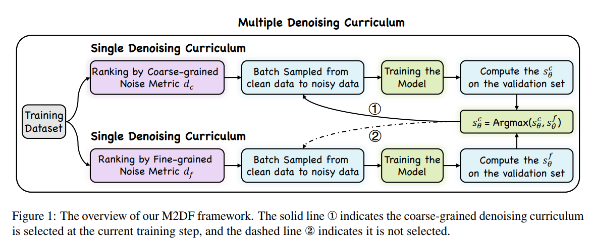

# M2DF

The implementation of EMNLP2023 paper "M2DF: Multi-grained Multi-curriculum Denoising Framework for Multimodal Aspect-based Sentiment Analysis"

## Overview



## Setup

### Dependencies

```
+ python 3.7.13
+ torch 1.12.0+cu113
+ numpy 1.21.6
+ transformers==3.4.0
+ fastnlp
+ h5py
```


### Download and preprocess the datasets

Because the image features after processing is very large, you can download them via the link [Google Drive](https://drive.google.com/drive/folders/1dXtmvkLi1N19Uv6zWClNnK2P3WYkexKQ?usp=share_link). It should be noted that the path of the data is consistent with the file tree.

```
├── /src/
│  ├── /data/
│  │  │  ├── /jsons/	       
│  │  │  │  ├── twitter15_info.json	        
│  │  │  │  ├── twitter17_info.json
│  │  │  │  ├── amended_similarity_by_region2015.json fine-grained similarity
│  │  │  │  ├── amended_similarity_by_region2017.json
│  │  │  │  ├── amended_similarity_by_whole2015.json coarse-grained similarity
│  │  │  │  ├── amended_similarity_by_whole2017.json
│  ├── /twitter2015/
│  ├── /twitter2017/
│  ├── /twitter2015_box_att_NER/
│  ├── /twitter2017_box_att_NER/
```

### Usage

- Train on twitter2015

```bash
sh 15_pretrain_full.sh
```

- Train on twitter2017

```bash
sh 17_pretrain_full.sh
```

### Log

Training log on tw17 (trained on GeForce GTX 1080 Ti) and tw15 (GeForce GTX 3090 Ti) are shown in the \log\
